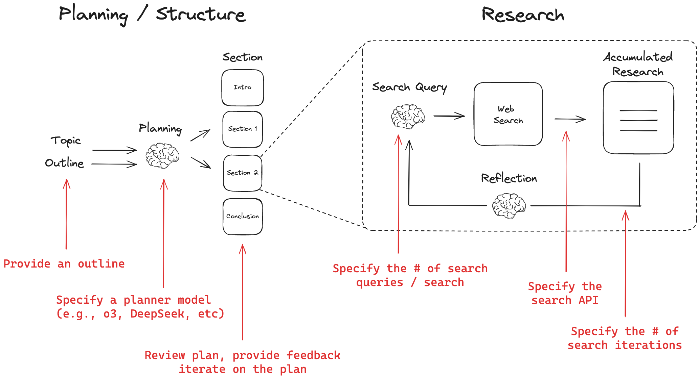
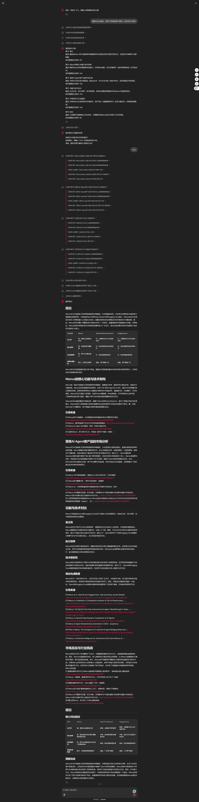

## 调度流程图


# 背景
> 主要是参考了langchain团队 最近推出的 open-deep-research进行的二次开发
> 二次开发的目的是因为 咱国内的技术人员 很多国外的 大模型 和 web search 不可用（或者说在企业内部不允许使用）
> 因此进行二开，结合chainlit 的 可视化页面 进行整体交互。

---
# 环境要求
python >= 3.9

安装相关包 依赖
```shell
pip install -r requirements.txt
```
---


## 相关api-key 获取
> 只针对国内，方便快速部署和调试
### 大模型api-key
1. [阿里云百炼平台](https://bailian.console.aliyun.com/)
2. [deepseek官方](https://platform.deepseek.com/)

### 联网搜索api-key
1. [博查api](https://bochaai.com/)
2. [tavily api](https://app.tavily.com)
3. 如果使用duckduckgo, 只需要能够科学上网，就可以直接访问 duckduckgo是完全免费的

## 启动前的必要配置
1. 环境变量配置：请复制 .env.example文件  然后更名为 .env 环境变量文件，请配置自己的deepseek api_key 或者 tongyi api_key 以及对应的 联网搜索 api_key。

2. deep_research/config/application_project.py 是所有全局配置入口，在第一步环境配置完成后，如果选择的大模型是deepseek 请将 MODEL_PROVIDER 进行对应修改。

MODEL_PROVIDER = "deepseek"
或者
MODEL_PROVIDER = "tongyi"

对应 联网搜索api-key配置完成后  也需要进行对应修改
WEB_SEARCH_TYPE = "bocha"
或者
WEB_SEARCH_TYPE = "tavily"
或者
WEB_SEARCH_TYPE = "duckduckgo"  

模型 和 联网 api 这块按照自己的喜好来，自己去进行拓展即可，拓展性做了基础保障。

## 服务启动
> 进入项目根目录
```shell
chainlit run chainlit_app.py
```

或者 直接进入 chainlit_app.py 直接在IDE run 也行。


## 演示示例
> 问题： 最近manus很火，研究下有类似的产品吗，以及对比下优劣
> 
> 因为整体思维链过长，因此使用长截图来展示
> 
> 具体效果 请自己启动服务后 进行对应调试


